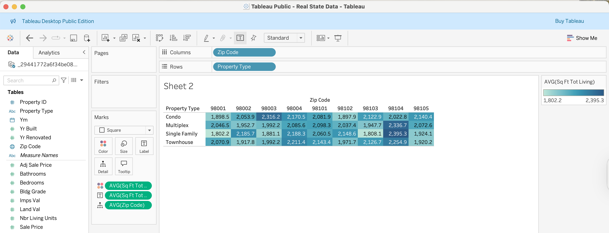
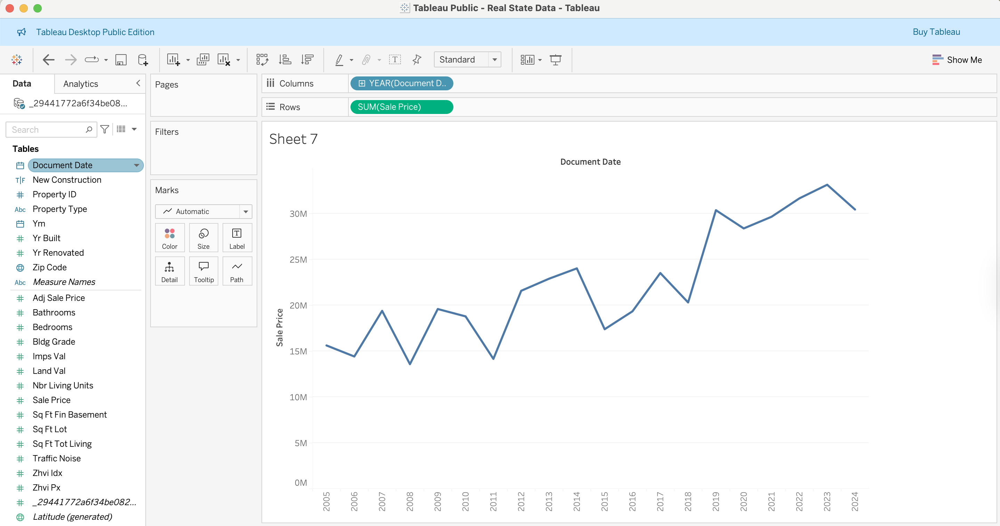
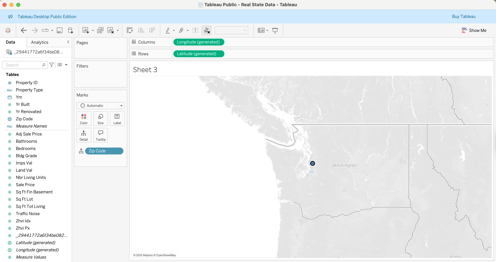
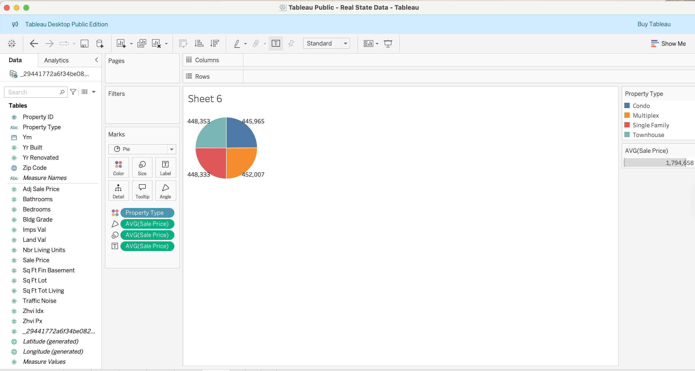
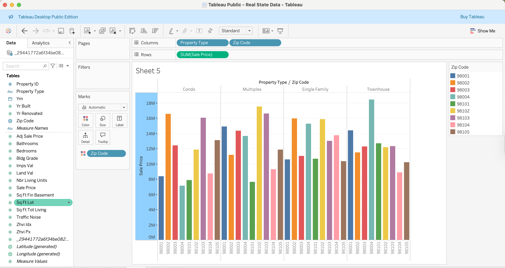
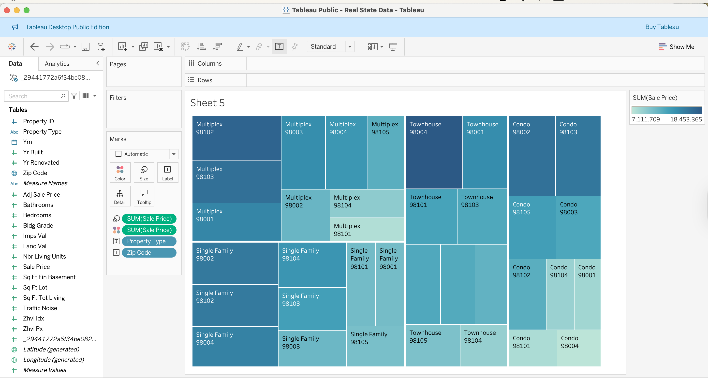

# Real Estate Project with Tableau

This project explores different visualization techniques in Tableau for analyzing real estate sales data.  
It demonstrates how to build and interpret a variety of charts, including:

- Horizontal, stacked, and side-by-side bar charts  
- Tree maps for hierarchical comparisons  
- Circle views and side-by-side circle views  
- Area charts for trends over time  

Each visualization highlights how different chart types can reveal insights such as sales distribution by zip code, property type, and overall market trends.

Highlight Table:

LineChart:

Map:

PieChart:

Side by side bar:

TreeMap:

