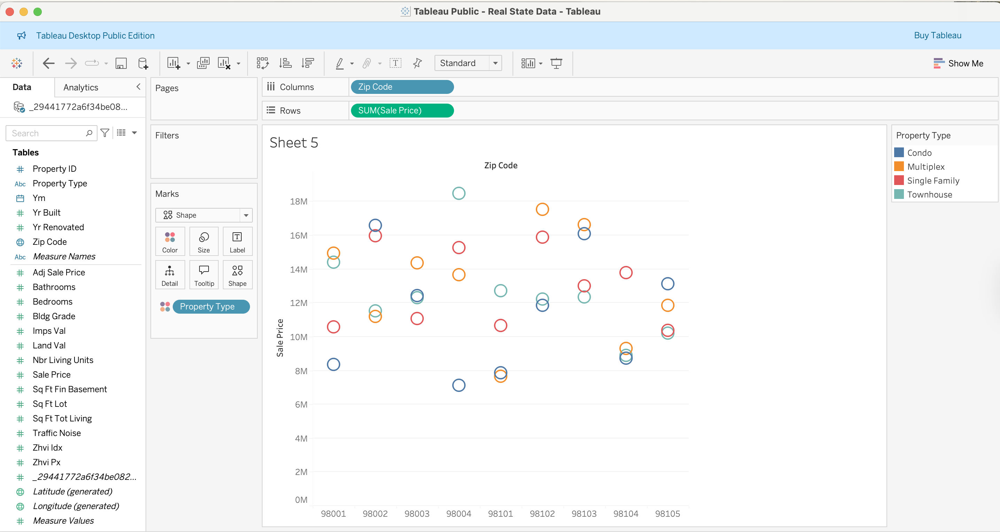

# Real Estate Project with Tableau

This project explores different visualization techniques in Tableau for analyzing real estate sales data.  
It demonstrates how to build and interpret a variety of charts, including:

- Horizontal, stacked, and side-by-side bar charts  
- Tree maps for hierarchical comparisons  
- Circle views and side-by-side circle views  
- Area charts for trends over time  

Each visualization highlights how different chart types can reveal insights such as sales distribution by zip code, property type, and overall market trends.

Highlight Table: This visualization shows each cell based on the value, cell-wise, making it easy to spotlight the highest and lowest cross-property types or zip codes.

Horizontal Bar comparative relationship as well as its approximate numeric value.

Symbol Map to represent a data point.

PieChart:

Side-by-side bar is useful for comparing the average price between properties, property types across zip codes.

TreeMap this allows us to identify which neighborhoods account for the highest volume or value of home sales, using area size to denote the magnitude of sales. 

A circle chart identifies an outlier, such as a neighbor with high total sales, big and dark circles, or a neighbor with low activity, small and light circles. 

The horizontal bar shows which zip codes have higher total sales. 

Area chart rising areas show growth in sales or activity, flattening areas show stagnation, and declining areas show in downturn.

Area chart 2 with another dimension, property type contribution over time.

LineChart to illustrate trends over time.

Histogram

